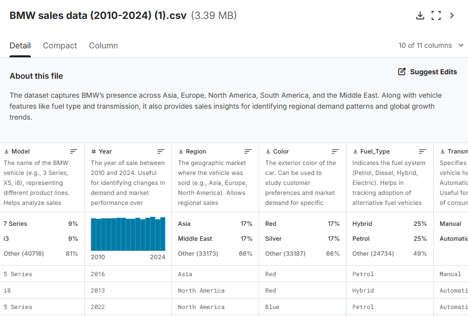
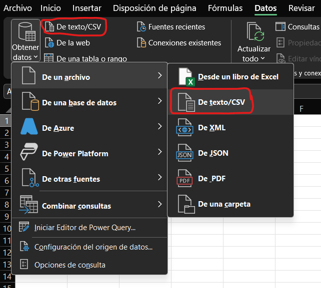
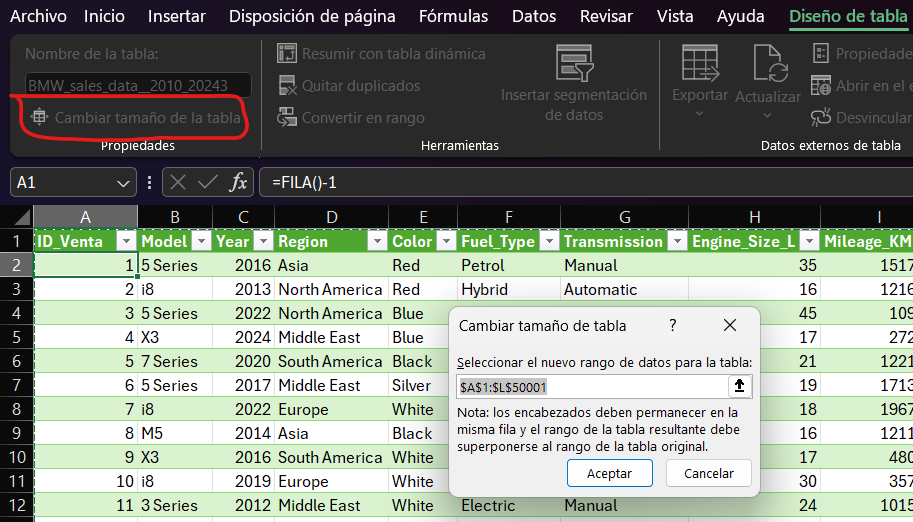
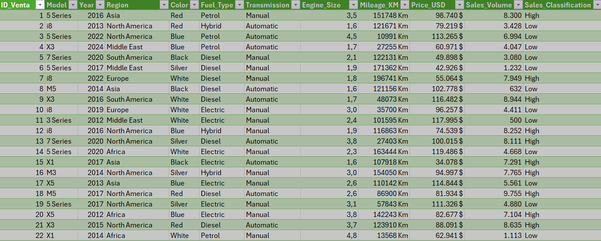
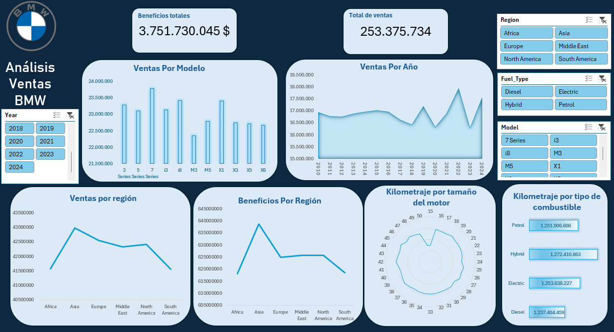

# 📊 Análisis de Datos BMW (2010–2024)
## Importación de los datos

Este análisis es una visión general del proceso realizado, se ha detallado en el siguiente documento.
[Ver análisis completo en PDF](Análisis_Ventas_BMW_con_Excel.pdf)

Previsualizamos el dataset en Kaggle y revisamos qué tipo de datos contiene cada columna:
🔗 Dataset: https://www.kaggle.com/datasets/ahmadrazakashif/bmw-worldwide-sales-records-20102024/data

### Previsualización del Dataset

### Descarga e importación en Excel

Una vez revisado el dataset, procedemos a descargar el archivo CSV e importarlo en Excel desde:
Datos → Obtener datos → Desde un archivo → Desde texto/CSV
Al seleccionar el dataset, Excel mostrará una ventana previa donde detectará automáticamente la estructura si el CSV está bien formateado.

### Ventana de importación

Tras ello, pulsamos Cargar (en hoja existente, en este caso). Una vez importados, los datos se cargan correctamente como tabla de Excel.
### Tabla importada en Excel

## Preparación de los datos
### Eliminación de duplicados
Seleccionamos la tabla importada, vamos a la pestaña Diseño de Tabla y pulsamos:

Quitar duplicados

Si no hay duplicados, Excel mostrará un mensaje indicándolo.
### Añadir columna ID

Creamos una columna llamada ID para identificar cada registro. Si la columna no queda dentro de la tabla:
Diseño de tabla → Cambiar tamaño de la tabla

### Corrección de formatos

Detectamos que algunas columnas no tenían el formato correcto:

Engine_Size_L
Mileage_KM
Price_USD
Sales_Volume

Tras corregirlos, la tabla queda así:

## Tablas dinámicas y construcción del Dashboard
Creamos las tablas dinámicas que servirán como base para los gráficos del Dashboard.

Un punto a destacar:

📌 Debido a que las localizaciones vienen por regiones, no ha sido viable representar el mapa sin perder integridad en los datos.

### Dashboard generado

Las tablas están correctamente conectadas a los segmentadores, permitiendo una interacción completa con el dashboard.

# 📈 Análisis
## Insights clave obtenidos mediante los gráficos
### 1. Serie 7 Híbrido: beneficios por región

El modelo más vendido presenta un comportamiento desigual:
En Oriente Medio, los beneficios se disparan.
En Europa, con ventas similares, los beneficios caen considerablemente.

### 2. El auge del eléctrico: X1 como nuevo top ventas

El BMW X1 eléctrico se convierte en el modelo líder dentro de los vehículos eléctricos.
Las ventas en el tiempo son más irregulares, pero…
La región que más eléctricos compra es Norteamérica.
En Oriente Medio, las ventas de eléctricos son bajas → beneficios bajos, pese a tener uno de los mayores kilometrajes por tipo de combustible.

### 3. Mercado asiático durante la pandemia
Contra lo esperado, Asia:
Mantiene un nivel de ventas estable y alto.
Se convierte en la región que más beneficios obtiene, destacando incluso durante la pandemia.

### 4. Kilometraje por tamaño del motor
Las motorizaciones medias (2.0L–3.0L) registran el mayor kilometraje, alineado con su uso intensivo y su presencia en modelos populares como Serie 3, X1 o X3.
Las motorizaciones grandes muestran menor kilometraje promedio, debido a su uso ocasional pese a generar mayor beneficio por vehículo.

# 💡 Insights adicionales

Se detecta que un gráfico adicional de beneficios por tipo de combustible sería útil para completar el análisis.
# 🛠️ Medidas propuestas tras el análisis

### 1. Recuperar beneficios en Europa para el Serie 7 híbrido

Problema: Ventas similares a Oriente Medio, pero beneficios mucho menores.

Medidas:
Optimizar margen por unidad mediante packs y reducción de descuentos.
Campañas premium de postventa para aumentar beneficio por cliente.

### 2. Aumentar la adopción de eléctricos en Oriente Medio
Problema: Bajos beneficios por escasa adopción.

Medidas:
Incentivos directos: financiación ventajosa, mantenimiento incluido.
Alianzas para instalar cargadores BMW en puntos clave.

### 3. Estabilizar ventas de eléctricos en Norteamérica
Problema: X1 eléctrico es líder pero presenta irregularidades.

Medidas:
Programas de fidelización (leasing, trade-in).
Mejor gestión de stock para evitar fluctuaciones por disponibilidad.

### 4. Aprovechar el alto rendimiento del mercado asiático

Problema/Oportunidad: Asia es la región más rentable incluso en pandemia.

Medidas:
Ofrecer configuraciones exclusivas adaptadas al mercado asiático.
Reforzar concesionarios premium para modelos de alta gama.

